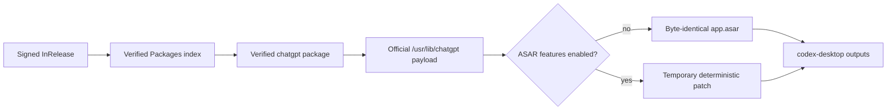

# Architecture

## Build flow

The sole upstream artifact is OpenAI's signed Linux `.deb`. Unattended builds
resolve it through signed stable APT metadata rather than trusting the moving
`latest` download alias.

1. `scripts/lib/upstream-linux-package.js` selects `amd64` or `arm64`, verifies
   OpenAI's signed stable metadata with the pinned repository key, and verifies
   the selected package digest and control fields.
2. `upstream-linux-package.sh` extracts the package data archive without running
   maintainer scripts and validates `/usr/lib/chatgpt`.
3. `install.sh` stages that directory as `codex-app/`, adds the compact launcher
   and metadata schema v2, and applies only explicitly enabled features.
4. If no enabled feature has ASAR descriptors, `resources/app.asar` is never
   unpacked and its SHA-256 must equal upstream. Otherwise a temporary copy is
   patched, deterministically repacked, and reported.
5. Package builders transform the same staged tree into deb, RPM, pacman, or
   AppImage output. Nix extracts the architecture-specific official package
   directly and wraps its ELF runtime.

## Trust boundaries

The repository key fingerprint is
`3BFA0E4AE8B8CC16A2D9BA684A3B4A566C4660E4`. `latest` download links are
convenience aliases only. Trust is derived from `InRelease`, then the digest of
the architecture-specific `Packages` file, then the package SHA-256 recorded in
that index. Wrong signatures, hashes, package names, versions, architectures,
or incomplete payloads fail closed.

The upstream source/key setup and maintainer scripts are never copied into the
custom package. This prevents an official package-manager transaction from
owning or replacing `/opt/codex-desktop`.

## Ownership

Upstream owns Electron, Owl, native modules, bundled commands, application
windows, single-instance behavior, URI handling, tray, login, and lifecycle.
This repository owns source verification, optional features, packaging,
AppArmor path adaptation, and transactional custom updates.

The launcher only establishes `codex-desktop` desktop identity, loads feature
environment/prelaunch/argument/lifecycle hooks, forwards arguments, and waits
when an after-exit hook exists.

The official Browser and Chrome plugins, their Linux extension host, and the
plugin app-server protocol are upstream runtime components. The former generic
Browser/Chrome Linux port layer is not part of the architecture. A separate
`thorium-chrome-plugin` feature remains opt-in because Thorium is not present in
the official browser registry.

## Repository layers

| Layer | Primary owners |
|---|---|
| Source trust and extraction | `scripts/lib/upstream-linux-package.*` |
| Candidate transaction and metadata | `install.sh`, `scripts/lib/install-helpers.sh`, `build-info.*` |
| Thin runtime wrapper | `launcher/start.sh.template` |
| Optional feature framework | `scripts/lib/linux-features.*`, `linux-features/` |
| ASAR descriptors and reports | `scripts/patches/`, `scripts/patch-linux-window-ui.js`, `scripts/lib/patch-report.js` |
| Cross-format payload assembly | `scripts/lib/package-common.sh`, `packaging/` |
| Native update state machine | `updater/src/`, `packaging/update-builder/` |
| Reproducible Nix packaging | `flake.nix`, `nix/` |
| Upstream drift automation | `scripts/automation/upstream-linux-package-watchdog/`, `.github/workflows/upstream-build-app.yml` |

## Patches and features

`scripts/patches/runner.js` composes an empty core registry with descriptors
from enabled features. Patch reports remain the candidate-acceptance contract.
An enabled feature's missing or drifted required surface rejects promotion;
disabled features do not participate.

The committed feature config is empty. Features stage declarative resources,
runtime hooks, package hooks, or narrowly scoped ASAR descriptors. Native helper
crates are built when producing this distribution, not during every upstream
runtime refresh.

Feature staging has separate application and native-package phases. App
resources stay inside the app tree; package resources install udev, systemd,
policy, or helper files only through validated package targets. The enabled
manifest snapshot is recorded in build metadata so packaging and updater
rebuilds cannot silently use a different selection.

## Identity and data

Native packages use `codex-desktop` and `/opt/codex-desktop`; the official app
uses `chatgpt`. The custom desktop entry is **ChatGPT Community**, with a
community-marked icon; desktop entries and AppArmor paths are distinct. The
upstream `Codex` profile is intentionally preserved for compatibility, so both
runtimes must not run simultaneously. The upstream single-instance lock governs
a second launch.

The wrapper has one narrowly scoped migration for bundled Browser and Chrome
cache snapshots created by the former Linux port. It replaces a cache only when
the bundled manifest matches and a retired marker is present, then restores the
official socket/host contract. It never clears arbitrary plugin caches or
user-authored plugins.

## Updates

The Rust updater polls signed metadata, downloads into a
version/architecture/SHA cache, runs the minimal packaged update-builder, and
builds a sibling candidate. Atomic promotion happens only after the app exits.
The previous managed artifact is retained for rollback. Old incompatible state
is reset without deleting installed or rollback packages.

## Generated state

`codex-app/`, side-by-side candidates, transactional backups, `dist/`,
`dist-next/`, Cargo `target/`, patch reports, and local feature configuration
are generated state. They are never source owners and should not be edited or
committed. See [Generated and runtime notes](agents/generated-and-runtime-notes.md).

## Architecture invariants

- The latest signed stable upstream package is the only supported baseline.
- The clean ASAR hash equals the official package hash.
- Upstream package scripts and APT source configuration never enter the custom
  output.
- `codex-desktop` package identity and **ChatGPT Community** display identity
  remain distinct from official `chatgpt` / **ChatGPT**.
- Optional behavior stays disabled in committed configuration.
- A core patch needs evidence of a mandatory baseline failure and a required
  regression test.
- Package/update/launcher/framework changes are cross-format unless proven
  otherwise.
